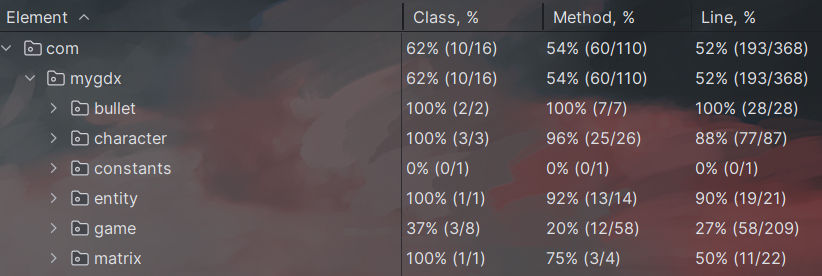

# Phase1: 并发

## 1. 游戏介绍

- 游戏分为两方：Hero和Enemy
- Hero位于地图左边，Enemy位于地图右边，两方无法越过中线
- 初始时，Hero和Enemy各有5个单位，每个单位有一定的血量和攻击力
- 双方可互相攻击，一方全部死亡后游戏结束
- 用户会被分配到Hero方，随机分配一个单位，可以控制其移动和攻击
- 其余单位由AI控制，AI会自动移动和攻击
- 用户通过wasd或方向键控制移动，鼠标单击控制攻击
- 用户操纵的角色会有边框标识，以区分其他角色

## 2. 实现详解

### 2.1 游戏逻辑

- 游戏逻辑由Game类实现，包括游戏初始化、游戏进行、游戏结束等
- 游戏初始化时，Game类会创建两个阵营，分别是Hero和Enemy，每个阵营包含5个单位，每个单位有一定的血量和攻击力
- 游戏进行时，Game类会根据用户输入的指令，控制用户所控制的单位移动和攻击，同时控制AI控制的单位移动和攻击
- 游戏结束时，Game类会根据双方的存活情况，判断游戏结果

### 2.2 角色单位

- 单位由Character类实现，包括单位的移动和攻击等
- 每个单位分配一个线程，负责相关的移动和攻击操作
- 使用ScheduledThreadPoolExecutor类实现线程池，来达到定期执行任务的效果

### 2.3 子弹单位

- 子弹由Bullet类实现，包括子弹的移动和攻击等
- 由于子弹较多，故所有子弹的移动和攻击由一个线程负责
- 同样使用ScheduledThreadPoolExecutor类来达到定期执行任务的效果

### 2.4 地图

- 地图比较简单，由Map类实现，负责绘制地图，管理单位的位置
- 使用syncronized关键字来实现对地图的安全访问

## 3. 演示视频

    https://www.bilibili.com/video/BV1na4y1Z7FN/

# Phase2: 构建

项目基于Gradle进行构建，在项目根目录下执行`./gradlew desktop:dist`即可构建项目，构建结果在`desktop/build/libs`目录下。

# phase3: 测试

在项目根目录下执行`./gradlew test`即可运行测试，测试覆盖率报告：

# phase4: IO

## 1. 地图保存/加载

由于地图比较简单，由10X10的格子组成，故地图的保存和加载比较简单，只提供了一个修改地图尺寸的接口，
自定义地图的宽和高，要求宽高为6-12之间的偶数，不许要相等。

## 2. 游戏存档/读档

游戏存档和读档比较复杂，由于游戏中的单位比较多，且单位的属性比较多，故采用了序列化的方式进行存档和读档。
点击存档按钮时，会首先停止游戏运行，接着对当前状态进行序列化，序列化后的数据会保存在`save`目录下。
读档时，会读取`save`目录下的文件，反序列化后，恢复游戏状态。

## 3. 游戏录制/回放

可以在游戏进行的任何时刻开始录制，录制时会将当前游戏状态序列化，保存在`record`目录下。
录制时，采用每一帧都进行序列化的方式，故录制的文件会比较大，且录制时耗费的资源较多。
回放时，会读取`record`目录下的文件，反序列化后，恢复游戏状态，然后开始回放，逐帧读取。

## 4. 演示视频

    https://www.bilibili.com/video/BV14j411p7nS/

# phase5: 网络通信

## 1. 通信协议

通信协议采用了自定义的协议，有一个 `GameState` 类表示游戏的全局状态，有若干个 `GameEvent` 类表示游戏中发生的事件。
`GameState` 类包含了游戏中所有单位的状态，`GameEvent` 类包含了游戏中发生的事件的类型和相关的参数。
使用 `jackson` 库来实现序列化和反序列化，发送时会将 `GameState` 类和 `GameEvent` 类序列化为 `json` 字符串，
接收时会将 `json` 字符串反序列化为 `GameState` 类和 `GameEvent` 类。

## 2. 通信流程

客户端和服务器端都会维护一个 `GameState` 类，表示游戏的全局状态，客户端和服务器端都会根据 `GameState` 类来更新游戏状态。
首先客户端会向服务器端建立连接，服务器端会将客户端加入游戏后的 `GameState` 类发送给客户端，
客户端接收到 `GameState` 类后，会根据 `GameState` 类来更新游戏状态，然后开始游戏。
游戏进行时，客户端会将用户的操作转换为 `GameEvent` 类，发送给服务器端，服务器端接收到 `GameEvent` 类后，
会根据 `GameEvent` 类来更新游戏状态，然后将 `GameEvent` 类广播给所有客户端，客户端接收到 `GameEvent` 类后，
会根据 `GameEvent` 类来更新游戏状态，然后继续游戏。

## 3. 通信实现

服务端使用 `NIO` 的 `Selector` 类来实现非阻塞的 `ServerSocketChannel` 类，客户端使用阻塞的 `Socket` 类来实现。
客户端和服务器端都维护了一个 `GameState` 类，使用 `ObjectMapper` 类来实现序列化和反序列化。
服务端为每个 `SocketChannel`，维护一个 `buffer`，用来存储将要发送的数据，并在可写的时候发送出去，
客户端则直接进行接收和发送数据。

## 4. 演示视频

    https://www.bilibili.com/video/BV1dp4y1o7Wg/